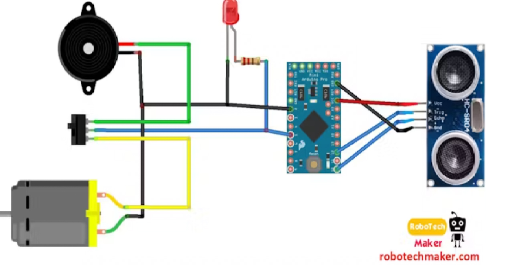

# Third Eye for the Blind


| **Engineer** | **School** | **Area of Interest** | **Grade** |
|:--:|:--:|:--:|:--:|
| Ryan B | Valley Christian High School | Engineering | Incoming Sophomore


<!--- **Replace the BlueStamp logo below with an image of yourself and your completed project. Follow the guide [here](https://tomcam.github.io/least-github-pages/adding-images-github-pages-site.html) if you need help.**--->

<!------>

<!---# Final Milestone--->
<!---For your final milestone, explain the outcome of your project. Key details to include are: - What you've accomplished since your previous milestone - What your biggest challenges and triumphs were at BSE - A summary of key topics you learned about - What you hope to learn in the future after everything you've learned at BSE --->

<!---**Don't forget to replace the text below with the embedding for your milestone video. Go to Youtube, click Share, Embed, and copy and paste the code to replace what's below.**--->

<!---iframe width="560" height="315" src="https://www.youtube.com/embed/F7M7imOVGug" title="YouTube video player" frameborder="0" allow="accelerometer; autoplay; clipboard-write; encrypted-media; gyroscope; picture-in-picture; web-share" allowfullscreen></iframe--->

# Second Milestone

<iframe width="560" height="315" src="https://www.youtube.com/embed/oeN6mqcE5e8" title="YouTube video player" frameborder="0" allow="accelerometer; autoplay; clipboard-write; encrypted-media; gyroscope; picture-in-picture; web-share" allowfullscreen></iframe>

Since my first milestone, I have moved the components to a more permanent system. I soldered most of the components to a perf board, which is a thin board with perforations that you can easily solder wires and parts to. I then made a way to attach everything to my hand by making a strap that wraps around my palm out of tape. I then used velcro to attach the main piece of circuitry to the back of my hand and taped the ultrasonic sensor to the palm of my hand. By separating the ultrasonic from the rest of the components, I can comfortably put it in the palm of my hand while being able to point at things with more ease. While making this setup, I did run into one small setback. I accidentally plugged the wires from the powered Arduino into the wrong ultrasonic pins which caused my sensor to break. But after swapping out for a new sensor, the device worked as intended and I was able to circumnavigate the room while blindfolded.

# First Milestone

<iframe width="560" height="315" src="https://www.youtube.com/embed/cw2lFAywD8Y" title="YouTube video player" frameborder="0" allow="accelerometer; autoplay; clipboard-write; encrypted-media; gyroscope; picture-in-picture; web-share" allowfullscreen></iframe>

For my main project, I decided to make the Third Eye for the Blind project which is a visual aid tool that can detect objects in its line of sight. I chose this because it had a real-world application and could be modified and improved upon in the future. The way it works is that the ultrasonic sensor sends out waves that bounce off of objects and return to the ultrasonic sensor. The program then takes the time it takes for the waves to travel out and come back and uses the time to determine the distance of the objects. Then based on the distance of the objects, the Arduino turns on the pins of the buzzers and LED. When it senses an object is closer, the buzzers will beep faster and at a higher pitch. One problem I initially ran into was my Arduino would run by itself but it was not able to activate any components on the breadboard. I then realized that the Arduino pins are not made to work with the breadboard so just attached jumper wires between the Arduino pins and the breadboard and then the circuit was able to run as intended. The next steps for this project are to make a physical hand mount for the ultrasonic and to move the rest of the circuits off of the breadboard. 

# Starter Milestone

<iframe width="560" height="315" src="https://www.youtube.com/embed/8CRr5LJR0LM" title="YouTube video player" frameborder="0" allow="accelerometer; autoplay; clipboard-write; encrypted-media; gyroscope; picture-in-picture; web-share" allowfullscreen></iframe>

For my starter project, I chose to make a useless machine. It's a machine with its sole purpose being to deactivate itself when turned on. The way it works is that there is a switch on top and when it is flicked, a motor runs which moves an arm up out of the box and flicks the switch back. The motor then runs in reverse and retracts the arm back into the box and it stops moving when it hits another switch inside the mechanism. I made this project by soldering some parts onto a circuit board and attaching them to a motor assembly. I then attached an arm to the motor and built a box around the system. The biggest challenge I faced was having to spend a lot of time undoing my mistakes because I didn't look over the instructions carefully enough before assembling something. At one point I soldered an LED to the wrong side of my PCB so I had to spend a lot of time de-soldering it and I had to get a new part.

# Schematics


# Code
```
  Arduino Code:
  
  const int pingTrigPin = 12;  
  const int pingEchoPin = 10;   
  int buz=8; 
  int led=6;
  int pch;
     
  void setup() {   
  Serial.begin(9600);   
  pinMode(buz, OUTPUT);
  pinMode(led, OUTPUT);   
  }   
  
  void loop(){   
    long duration, cm;   
    
    pinMode(pingTrigPin, OUTPUT);   
    digitalWrite(pingTrigPin, LOW);   
    delayMicroseconds(2);   
    digitalWrite(pingTrigPin, HIGH);   
    delayMicroseconds(5);   
    digitalWrite(pingTrigPin, LOW);   
    pinMode(pingEchoPin, INPUT);   
    duration = pulseIn(pingEchoPin, HIGH);   
    cm = microsecondsToCentimeters(duration);   
  
    if(cm<=90 && cm>0){   
      int d= map(cm, 1, 100, 15, 1000);   
      //digitalWrite(buz, HIGH);
      tone(buz, pch);
      digitalWrite(led, HIGH);
      delay(50);   
      //digitalWrite(buz, LOW);
      noTone(buz);
      digitalWrite(led, LOW);
   
      delay(d / 2);
      pch= 4400;
    
      Serial.println(pch);
      }   
     
    delay(50);   
    }   
  
  long microsecondsToCentimeters(long microseconds){   
    return microseconds / 29 / 2;   
    } 
```

<!---# Bill of Materials--->
<!---Here's where you'll list the parts in your project. To add more rows, just copy and paste the example rows below.--->
<!---Don't forget to place the link of where to buy each component inside the quotation marks in the corresponding row after href =. Follow the guide [here]([url](https://www.markdownguide.org/extended-syntax/)) to learn how to customize this to your project needs. --->

<!---| **Part** | **Note** | **Price** | **Link** |--->
<!---|:--:|:--:|:--:|:--:|--->
<!---| Item Name | What the item is used for | $Price | <a href="https://www.amazon.com/Arduino-A000066-ARDUINO-UNO-R3/dp/B008GRTSV6/"> Link </a> |--->
<!---|:--:|:--:|:--:|:--:|--->
<!---| Item Name | What the item is used for | $Price | <a href="https://www.amazon.com/Arduino-A000066-ARDUINO-UNO-R3/dp/B008GRTSV6/"> Link </a> |--->
<!---|:--:|:--:|:--:|:--:|--->
<!---| Item Name | What the item is used for | $Price | <a href="https://www.amazon.com/Arduino-A000066-ARDUINO-UNO-R3/dp/B008GRTSV6/"> Link </a> |--->
<!---|:--:|:--:|:--:|:--:|--->

